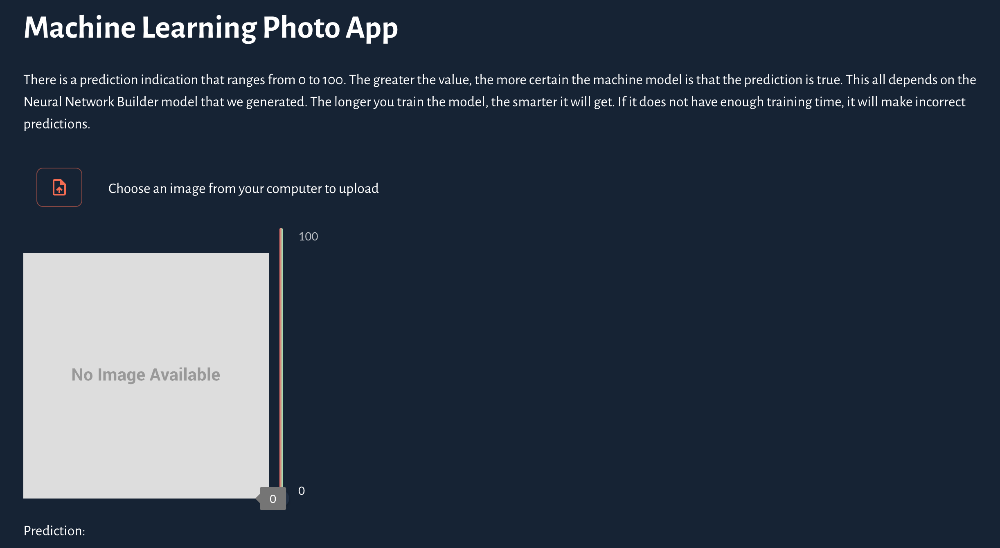
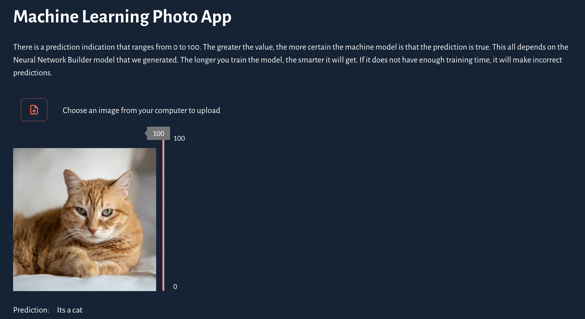

# ML Photo App

A [Taipy](https://taipy.io/) web app that classifies a PNG image as one of the 10 [CIFAR-10](https://www.cs.toronto.edu/~kriz/cifar.html) classes: airplane, automobile, bird, cat, deer, dog, frog, horse, ship, or truck.

Upload a photo, and the trained Keras model returns a predicted label plus a confidence score from 0 to 100.



*Default view: no image uploaded yet, confidence at 0, and no prediction.*



*After upload: the model identified this photo as a cat with a confidence of 100.*

## Requirements

- **Python 3.11** (required). TensorFlow 2.15 does not support newer versions such as 3.12–3.14.
- pip
- macOS, Linux, or Windows

On macOS with Homebrew:

```shell
brew install python@3.11
```

Confirm with:

```shell
python3.11 --version
```

## Project layout

The directories named `venv` hold **application source**, not a Python virtual environment. Create a real virtualenv as `.venv` next to that source.

```text
ml-photo-app/
├── docs/                         # README screenshots
├── frontend/
│   ├── .venv/                    # create this (gitignored)
│   └── venv/                     # frontend source
│       ├── index.py              # Taipy UI and inference
│       ├── index.css
│       ├── requirements.txt
│       ├── model/                # Keras model used by the app
│       └── test-images/          # sample PNGs to try
└── neural-network-builder/
    └── venv/                     # training source
        ├── generate-model.py     # trains and saves the Keras model
        ├── requirements.txt
        ├── cifar-10-batches-py/  # CIFAR-10 dataset
        └── model/                # output of training
```

A trained model is already in `frontend/venv/model/`. You can run the app without retraining.

## Run the app

From the repository root:

```shell
cd frontend
python3.11 -m venv .venv
source .venv/bin/activate          # Windows: .venv\Scripts\activate
pip install --upgrade pip
pip install -r venv/requirements.txt
cd venv
python index.py
```

Open [http://127.0.0.1:8000](http://127.0.0.1:8000).

Leave the virtualenv with `deactivate`.

### Using the app

1. Click the upload button.
2. Choose a **PNG** file (other formats are not accepted).
3. The image is resized to 32×32, classified, and shown with a confidence indicator and a prediction such as `Its a cat`.

Sample images are in `frontend/venv/test-images/` (`image01.png` through `image10.png`).

## Retrain the model (optional)

Training runs for 50 epochs and can take a long time. It overwrites `neural-network-builder/venv/model/cifar-10-batches-py-model.keras`.

```shell
cd neural-network-builder
python3.11 -m venv .venv
source .venv/bin/activate          # Windows: .venv\Scripts\activate
pip install --upgrade pip
pip install -r venv/requirements.txt
cd venv
python generate-model.py
```

Copy the new model into the frontend, then restart the app:

```shell
cp neural-network-builder/venv/model/cifar-10-batches-py-model.keras frontend/venv/model/
```

Longer training generally improves accuracy. A short or undertrained run will misclassify more images.

## Troubleshooting

| Problem | What to do |
| --- | --- |
| `pip` cannot find TensorFlow | Use Python 3.11, not 3.12+. |
| `cannot import name 'pprint' from 'marshmallow'` | Reinstall from `frontend/venv/requirements.txt` (it pins `marshmallow<4`). |
| `No module named 'pkg_resources'` | Reinstall from `frontend/venv/requirements.txt` (it pins `setuptools<81`). |
| `Unable to load model` | Run `python index.py` from `frontend/venv`, where the `model/` directory lives. |
| Upload does nothing | The file picker only accepts `.png` files. |
